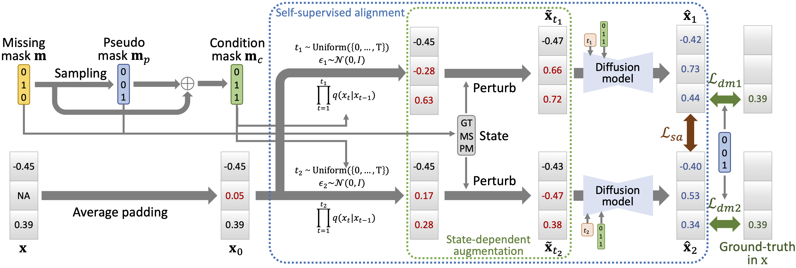

# Self-Supervision Improves Diffusion Models for Tabular Data Imputation

This is the source code of CIKM'24 paper "[Self-Supervision Improves Diffusion Models for Tabular Data Imputation]()" (SimpDM). 



## USAGE

### Step 1. Create a new conda environment with Python 3.10:
conda create -n simpdm python=3.10

### Step 2. Initialize the environment by running:
bash init_env.sh

### Step 3. Run the corresponding script in “run.sh”. For example, for Yacht dataset we can run the first line:
python3 main.py --dataset yacht --epochs 30000 --lr 0.0001 --num_layers 5 --hidden_units 256 --gammas 1.0_0.8_0.001 --ssl_loss_weight 10

## CITE

If you compare with, build on, or use aspects of SimpDM framework, please cite the following:
```
```
